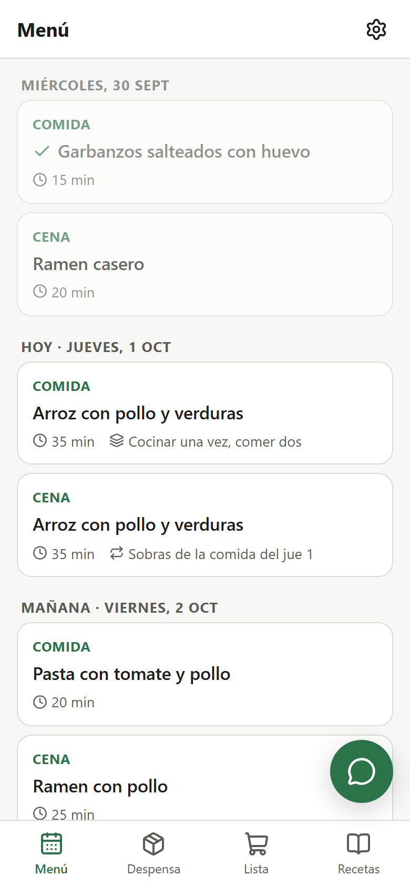
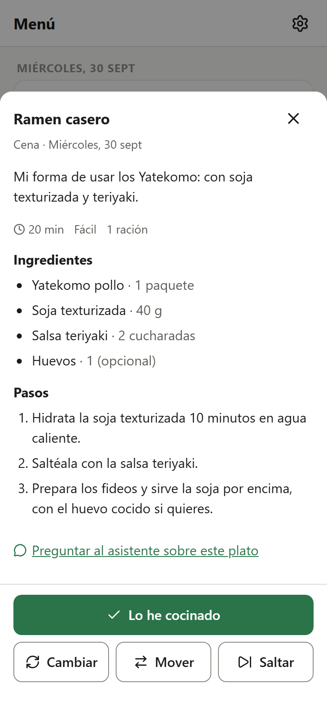
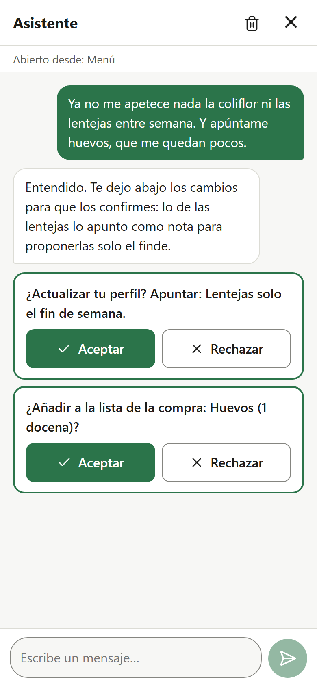
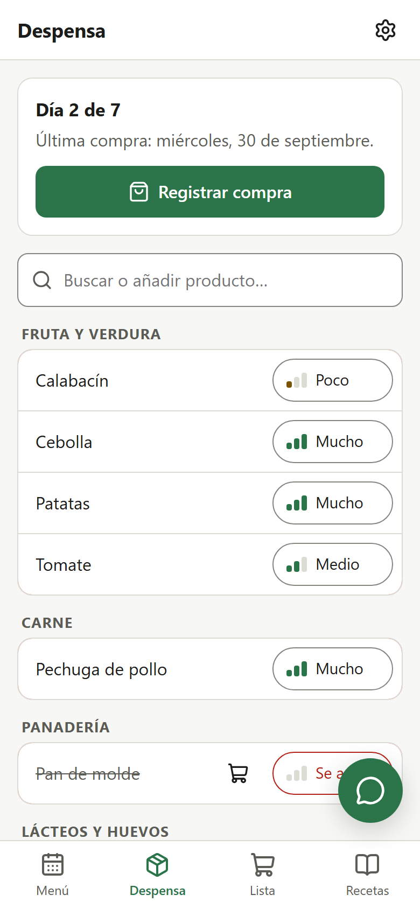
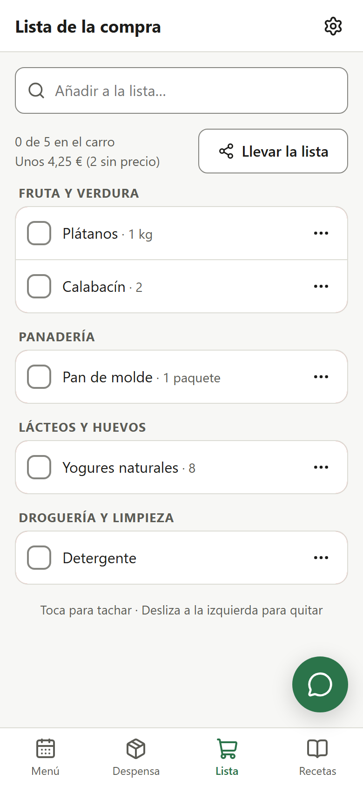
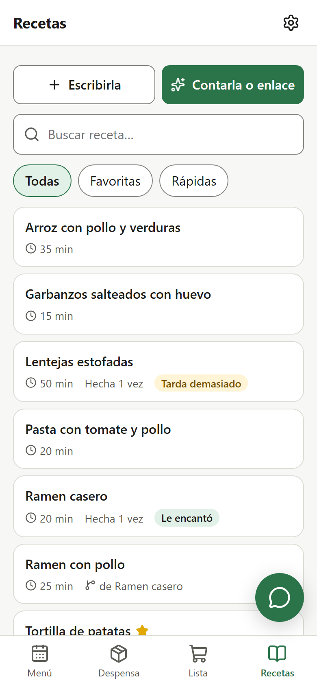
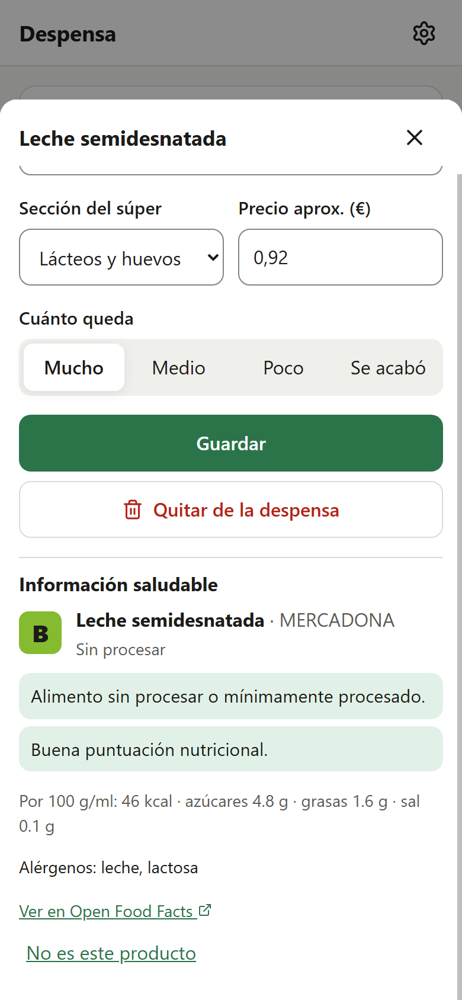

# Pantry & Menus

A personal web app that plans what I cook and what I buy, with an AI assistant that learns my tastes.

**The problem:** every week I have to decide what to eat, check what's left at home and write a shopping list. This app works shopping trip to shopping trip: after each shop it proposes a menu built around what I already have, and turns whatever is missing into a shopping list sorted by supermarket aisle.

<p align="center">
  
  
  
  
</p>
<p align="center">
  
  
  
</p>

## Features

- **Menus per shopping cycle.** The AI plans the days until the next shop around the pantry, my tastes and the time I have each day (quick on weekdays, longer at weekends), with batch cooking and leftovers. Dishes can be changed, moved, skipped or marked as cooked.
- **Dietary restrictions as hard filters, checked in code** on every ingredient, not just as instructions to the AI. Dishes that break them are sent back to be replaced; unknown ingredients are flagged.
- **Assistant that proposes, never changes.** A chat on every screen (or about a specific dish) that answers questions like "I'm out of tomato, what can I use?" and, when I ask for changes, returns structured actions shown as confirmation cards. Accepted actions are logged and can be undone.
- **Pantry and receipts.** Approximate levels instead of exact quantities. A photo or PDF of the receipt is read by the AI, matched with known products and always reviewed before saving.
- **Shopping list by aisle**, fed by the menu, the pantry or by hand; exported as text, `.txt` or a printable page.
- **Recipe book that grows with use:** AI dishes I cook, my own recipes, recipes told informally in the chat, or imported from a link (schema.org JSON-LD first, AI only as a fallback). Variations, recipes linked to a product, and quick feedback instead of stars ("too slow", "don't propose it again") that the planner takes into account.
- **Is it healthy?** Nutri-Score, processing level and plain-language notes from [Open Food Facts](https://world.openfoodfacts.org) ("this drink is almost all sugar"), plus approximate prices from the receipts.
- **Usable without AI:** if the provider is down or the free quota runs out, everything except the assistant keeps working.

### Design decisions

- **The app owns the memory.** Profile, pantry, recipes and history live in SQLite; for each task a `contextBuilder` sends the AI only a short summary. Switching providers loses nothing.
- **Everything the AI returns is validated with zod** (one retry, then a friendly error). Confirmation cards are written by code, not by the AI, so they say exactly what will happen.
- **Zero budget:** Gemini's free tier (with a lighter fallback model when the main one is overloaded), SQLite, runs locally.
- **Accessibility:** WCAG AA colour contrast in light and dark mode (checked), large touch targets, labelled icon buttons, keyboard-friendly dialogs and reduced motion support.

## Stack

| Part | Tech |
|---|---|
| Frontend | React, Vite, React Router, mobile-first CSS with custom properties (light/dark) |
| Backend | Node.js, Express 5, zod |
| Database | SQLite (better-sqlite3) behind a small repository layer |
| AI | Google Gemini (free tier) behind a provider-agnostic `aiService` |

## Getting started

Requirements: Node.js 22.9+.

```bash
npm install
cp backend/.env.example backend/.env   # then add your GEMINI_API_KEY
npm run dev
```

- PC: http://localhost:5173
- **Phone on the same Wi-Fi:** open the `Network` address Vite prints (e.g. `http://192.168.1.x:5173`) and use "Add to home screen". The phone only talks to Vite, which forwards `/api` to the backend, so the backend stays private to the PC.

**Try it with demo data:** `npm run demo` fills a separate database (`backend/data/demo.db`) with a week of menus, a pantry, recipes and a conversation with pending cards. Your real data is not touched.

Production-like run: `npm run build && npm start` (Express serves the built frontend).

### Environment variables

All documented in [`backend/.env.example`](backend/.env.example):

| Variable | Default | Purpose |
|---|---|---|
| `AI_PROVIDER` | `gemini` | AI provider |
| `AI_MODEL` | `gemini-flash-latest` | Model for that provider |
| `AI_FALLBACK_MODEL` | `gemini-flash-lite-latest` | Model for the retry when the main one is overloaded |
| `GEMINI_API_KEY` | — | Free key from [Google AI Studio](https://aistudio.google.com/apikey) |
| `PORT` / `HOST` | `3001` / `127.0.0.1` | Where the API listens |
| `DB_PATH` | `./data/app.db` | SQLite file |

API keys live only in `backend/.env` (git-ignored); the frontend never sees them.

### Switching AI provider

The rest of the app only calls `backend/src/ai/aiService.js`. To add Claude, Groq, Ollama…:

1. Create `backend/src/ai/providers/<name>.js` exposing `generate({ system, messages, json, files })`, like [`gemini.js`](backend/src/ai/providers/gemini.js).
2. Register it in the `PROVIDERS` map in `aiService.js`.
3. Set `AI_PROVIDER`, `AI_MODEL` and its key in `.env`.

## Project structure

```
backend/src/
  ai/       aiService, providers, contextBuilder, prompts, zod schemas
  domain/   business rules (restrictions, menus, assistant actions…)
  db/       SQLite connection, schema, migrations, repositories (the only place with SQL)
  routes/   thin REST endpoints
  lib/      helpers (Open Food Facts client, safe page fetching, dates…)
frontend/src/
  pages/  components/  context/  hooks/  api/  styles/
docs/       full spec, data model and screenshots
```

## Future work

- **Authentication and multi-user.** There is no login: it is meant for one person on a home network, and must be added before any deployment to the internet (along with HTTPS and rate limiting of the AI endpoints).
- Internet deployment (configuration is already environment-based).
- With HTTPS: offline shopping list, sharing via the Web Share API on the phone and barcode scanning with the camera.
- Notifications and reminders.
- Exact quantities and expiry dates in the pantry.
- Recipe import from videos (today they are told to the assistant as text).
- No supermarket scraping, by design: products are entered by hand, from receipts, or learned through use.
